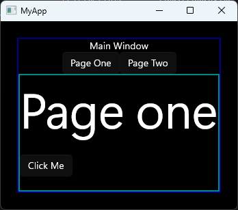
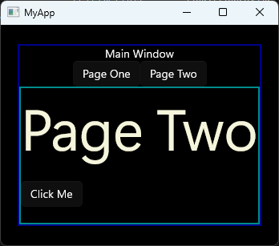

[![Contributors][contributors-shield]][contributors-url]
[![Forks][forks-shield]][forks-url]
[![Stargazers][stars-shield]][stars-url]
[![Issues][issues-shield]][issues-url]
[![MIT License][license-shield]][license-url]
[![LinkedIn][linkedin-shield]][linkedin-url]

<br />
<div align="center">
    <a href="https://github.com/TirsvadGUI/Cpp.Winui3.MainWindow.Pages.Example">
        
    </a>
    <h3 align="center">Cpp Winui-3 MainWindow and pages example</h3>
    <p align="center">
    Example of Mainwindows where it changes contents based on my pages. Screenshots are maked with border color to show the different pages vs window.
    <br />
    <br />
    <!-- PROJECT SCREENSHOTS -->
    <a href="https://github.com/Tirsvad/TirsvadGUI.Cpp.Winui3.MainWindow.Pages.Example/blob/master/images/Screenshot01.png">
        
    </a>
    <a href="https://github.com/Tirsvad/TirsvadGUI.Cpp.Winui3.MainWindow.Pages.Example/blob/master/images/Screenshot02.png">
        
    </a>
    <br />
    <a href="https://github.com/TirsvadGUI/Cpp.Winui3.MainWindow.Pages.Example"><strong>Explore the docs »</strong></a>
    <br />
    <br />
    <a href=https://github.com/TirsvadGUI/Cpp.Winui3.MainWindow.Pages.Example/issues/new?labels=bug&template=bug-report---.md">Report Bug</a>
    ·
    <a href="https://github.com/TirsvadGUI/Cpp.Winui3.MainWindow.Pages.Example/issues/new?labels=enhancement&template=feature-request---.md">Request Feature</a>
    </p>
</div>

## About The Project

This is a simple example of how to create a main window with pages.
The pages are created as user controls and the main window is a window that can change the content based on the page that is selected.

## Getting Started

To get a local copy up and running follow these simple steps.

### Prerequisites

* [Visual Studio 2022](https://visualstudio.microsoft.com/vs/)


## Get source code {.tabset .tabset-fade}

### PowerShell
```powershell
git clone git@github.com:TirsvadGUI/Cpp.Winui3.MainWindow.Pages.Example.git
```


[contributors-shield]: https://img.shields.io/github/contributors/TirsvadGUI/Cpp.Winui3.MainWindow.Pages.Example?style=for-the-badge

[contributors-url]: https://github.com/TirsvadGUI/Cpp.Winui3.MainWindow.Pages.Example/graphs/contributors

[forks-shield]: https://img.shields.io/github/forks/TirsvadGUI/Cpp.Winui3.MainWindow.Pages.Example?style=for-the-badge

[forks-url]: https://github.com/TirsvadGUI/Cpp.Winui3.MainWindow.Pages.Example/network/members

[stars-shield]: https://img.shields.io/github/stars/TirsvadGUI/Cpp.Winui3.MainWindow.Pages.Example?style=for-the-badge

[stars-url]: https://github.com/TirsvadGUI/Cpp.Winui3.MainWindow.Pages.Example/stargazers

[issues-shield]: https://img.shields.io/github/issues/TirsvadGUI/Cpp.Winui3.MainWindow.Pages.Example?style=for-the-badge

[issues-url]: https://github.com/TirsvadGUI/Cpp.Winui3.MainWindow.Pages.Example/issues

[license-shield]: https://img.shields.io/github/license/TirsvadGUI/Cpp.Winui3.MainWindow.Pages.Example?style=for-the-badge

[license-url]: https://github.com/TirsvadGUI/Cpp.Winui3.MainWindow.Pages.Example/blob/master/LICENSE.txt

[linkedin-shield]: https://img.shields.io/badge/-LinkedIn-black.svg?style=for-the-badge&logo=linkedin&colorB=555

[linkedin-url]: https://www.linkedin.com/in/jens-tirsvad-nielsen-13b795b9/
